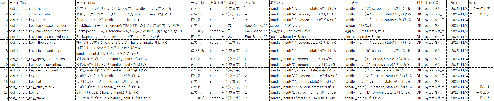
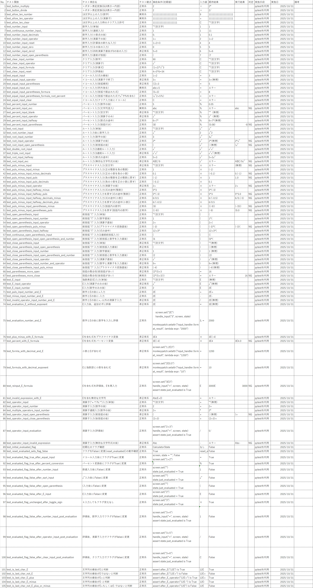
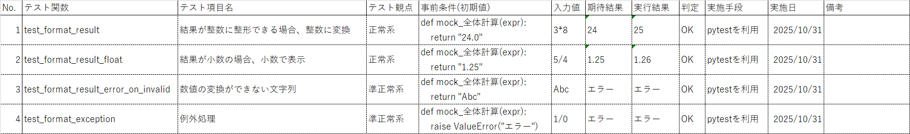

# 電卓プログラム テスト仕様書

バージョン: 1.1 
最終更新日: [2025/11/04]
作成日: [2025/10/24] 
作成者: [作成者名 / 松本経理ビジネス専門学校 Team A ]  
リポジトリ: [mkeiri-pc202/_calculator](https://github.com/mkeiri-pc202/_calculator)

---

## 1.概要
- 対応プログラム: 電卓(_calculator)
- 対象機能: 四則演算、入力検証、エラーハンドリング
- テスト目的: 各機能が仕様通りに動作することを確認する

## 2.テスト環境
- OS: Windows 11 Education(24H2)
- Python: 3.13.9
- エディタ: Visual Studio Code 1.105.1
- テストフレームワーク: pytest
- 実行方法: ターミナルにて pytest を実行
- 依存ライブラリ:
- バージョン管理: Github
- 実行端末: CPU: AMD Athlon Silver 3050U with Radeon Graphics(2.30 GHz) RAM: 8.0GB

## 3.テスト項目一覧
### 3.1 単体テスト一覧
- 対象ファイル:app.py テストファイル:test_app.py

- 対象ファイル:input_handler.py テストファイル:test_input_handler.py

- 対象ファイル:keisan.py 

- 対象ファイル:utils.py テストファイル:test_utils.py

### 3.2 統合テスト一覧

| 項目     | 実施内容                                                       | 入力内容          | 結果                   | 判定 |                                                                                                                                    |
|----------|----------------------------------------------------------------|-------------------|------------------------|------|------------------------------------------------------------------------------------------------------------------------------------|
| 足し算   | 数字２つの足し算                                               | 1+1               | 2                      | OK   |                                                                                                                                    |
| 足し算   | 数字３つの足し算                                               | 1+1+1             | 3                      | OK   |                                                                                                                                    |
| 足し算   | 数字３つの足し算と引き算                                       | 7+6-2             | 11                     | OK   |                                                                                                                                    |
| 足し算   | 数字２桁の足し算                                               | 101+10            | 111                    | OK   |                                                                                                                                    |
| 足し算   | 小数点の足し算                                                 | 1.1+2.2           | 3.3                    | OK   |                                                                                                                                    |
| 引き算   | 数字２つの引き算                                               | 5-2               | 3                      | OK   |                                                                                                                                    |
| 引き算   | 数字２つの引き算                                               | 5-3-2             | 0                      | OK   |                                                                                                                                    |
| 引き算   | 数字２つの引き算(結果がマイナスになる）                        | 5-10              | -5                     | OK   |                                                                                                                                    |
| 引き算   | 小数点の引き算                                                 | 1.2-3.3           | -2.1                   | OK   |                                                                                                                                    |
| 引き算   | 数字２つの引き算                                               | 10-100            | 90                     | OK   |                                                                                                                                    |
| 掛け算   | 数字２つの掛け算                                               | 5*5               | 25                     | OK   |                                                                                                                                    |
| 掛け算   | 数字３つの掛け算                                               | 2*2*2             | 8                      | OK   |                                                                                                                                    |
| 掛け算   | 数字２桁の掛け算                                               | 50*22             | 1100                   | OK   |                                                                                                                                    |
| 掛け算   | 小数点の掛け算                                                 | 1.1*2-2           | 0.2                    | OK   |                                                                                                                                    |
| 掛け算   | マイナスの掛け算                                               | 5*(-5)            | -25                    | OK   |                                                                                                                                    |
| 割り算   | 数字２つの割り算                                               | 1/2               | 0.5                    | OK   |                                                                                                                                    |
| 割り算   | 数字２つの割り算(割り切れない                                  | 1/3               | 0.333333333            | OK   |                                                                                                                                    |
| 割り算   | 数字２桁の割り算                                               | 90/50             | 1.8                    | OK   |                                                                                                                                    |
| 割り算   | 小数点の割り算                                                 | 1.5/2             | 0.75                   | OK   |                                                                                                                                    |
| 10の指数 | 指数表示                                                       | 1E5               | 100000                 | OK   | 計算結果の桁あふれの時に指数が使われないのは直せたら直したいなぁ                                                                   |
| 10の指数 | 指数表示                                                       | 1E5 + 1           | エラー                 | NG   | 指数表示に演算子が加わるとすべてエラー                                                                                             |
| 乗数     | 乗数の計算                                                     | 2^2^3             | 4096                   | OK   |                                                                                                                                    |
| √        | √の計算                                                        | √2                | 1.414213562            | OK   |                                                                                                                                    |
| √        | √の計算                                                        | 2+√2              | 3.414213562            | OK   |                                                                                                                                    |
| √        | √の計算                                                        | 2*√2              | 2.828427125            | OK   |                                                                                                                                    |
| √        | √の計算                                                        | √2^√2             | 1.632526919            | OK   |                                                                                                                                    |
| √        | √の計算                                                        | √2*2              | 2.828427125            | OK   |                                                                                                                                    |
| √        | √の計算                                                        | √2+2              | 3.414213562            | OK   |                                                                                                                                    |
|          |                                                                |                   |                        |      |                                                                                                                                    |
|          |                                                                |                   |                        |      |                                                                                                                                    |
| その他   | クリアを押下                                                   | -                 | 文字が消えた           | OK   |                                                                                                                                    |
| その他   | 演算子の後にバックスペースが効かない                           |                   |                        | NG   | 修正する                                                                                                                           |
| その他   | 数字が19桁以上入力できない                                     |                   |                        | OK   |                                                                                                                                    |
| その他   | 計算結果が19桁以上だと桁があふれる                             | 999999999999999^9 | 長すぎてコピーできない | NG   | 計算結果が19桁以上の場合は計算結果を返さずにエラーにすればいいのでは？      7^7^7だとinfで表示されてたから、チェックははいってる？ |
| その他   | ±のかっこを外すと、整数でもfloatになって表示されてしまっている |                   |                        | NG   | 一度直した気はする（戻ってる？                                                                                                     |
| その他   | 小数点がある状態で±を押すと表示がおかしくなる                  |                   |                        | NG   | 一度直した気はする（戻ってる？                                                                                                     |
| その他   | 数字の後に(を押す                                              |                   | 7*(へ変換される        | OK   |                                                                                                                                    |
| その他   | 数字の後に)を押す                                              |                   | 入力されない           | OK   |                                                                                                                                    |
| その他   | Windowサイズの最大化は無効にしてもよいと思う                   |                   |                        | -    | 最大化できる意味もないので無効にしてもよいかもしれない                                                                             |
| その他   | 小数点を使った計算不可能な値が入力できていないか               |                   | 1.5.5.5.5              | NG   | 計算結果はNGを返しているが入力できないほうがいい                                                                                   |
